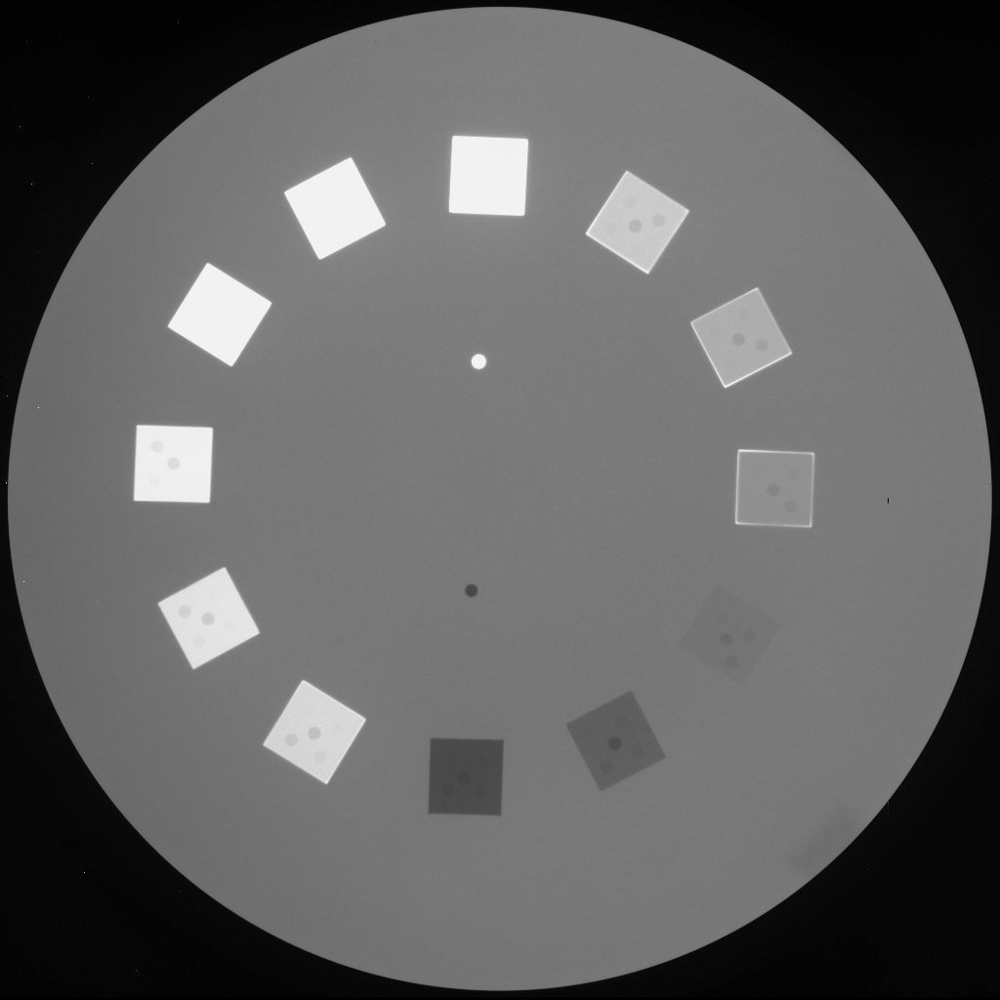

# Edge Detection and Segmentation Using Compass Masks

## Overview
In this exercise, we are tasked with segmenting the image contained in the file **disk1.jpg** to extract the contours of squares inside circles. The segmentation will be performed by first enhancing the edges of the image and then using Sobel compass masks to detect edges. Morphological operators will be applied to improve the final results if necessary.

The main steps of the process include:
1. **Edge Enhancement**: Enhance the edges in the original image.
2. **Sobel Compass Masks**: Apply Sobel filters (compass masks) to detect edges.
3. **Morphological Operations**: Optionally apply morphological operations to refine the segmentation.
4. **Segmentation Visualization**: Display the results in separate figures with appropriate titles, showing the edge-enhanced image and the final segmented contours.

---

## Preview of Input Image  

  

