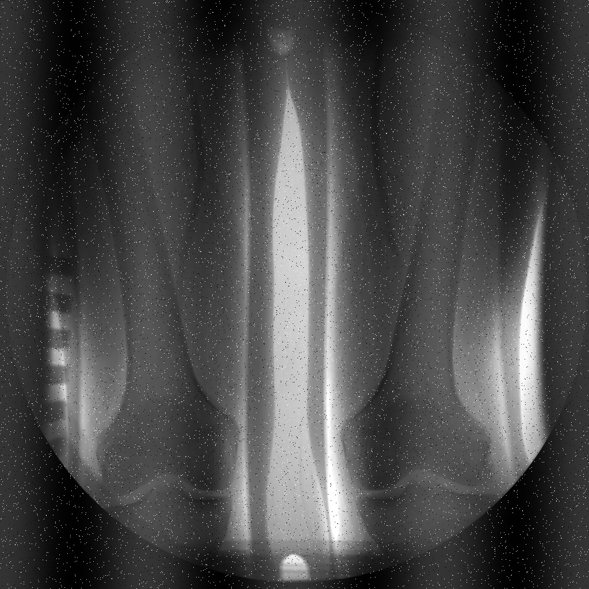

# Noise Identification and Filtering

---

## Overview
In this exercise, will be  analyze the image present in the file **es3_2024.mat** that has been corrupted by noise. The objective is to identify the type of noise affecting the image, estimate its numerical parameters, and then design a filtering solution to reduce or remove the noise.

The steps will involve:
1. **Noise Identification**: Analyze the image to determine the type of noise (e.g., Gaussian, Salt and Pepper, Poisson, etc.) and its relevant numerical parameters.
2. **Design Filtering Solution**: Implement a filtering approach that aims to reduce or eliminate the identified noise.
3. **Visualization and Results**: Compare the original noisy image with the filtered image and show the results in the report.

---

## Preview of Input Image  

  

